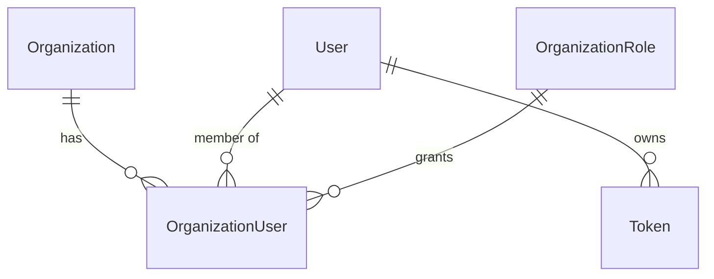

<!-- Instadash AI Base (managed file — edit via /upgrade, not by hand) — (c) Letstream Ventures Pvt Ltd, https://www.theletstream.com. Provided "AS IS" without warranty unless covered by an explicit written agreement; unauthorized use or redistribution is prohibited. -->
# Data Model

> The project's entities and relations. **Keep it current**: every task that adds or changes a
> model updates this page (AGENTS.md §1). The *Base models* section is shared by every project; the
> *Project models* section is written at [Bootstrap](./bootstrap/interview.md) and grows with the product.
> Conventions: [conventions](./conventions.md), [apps-architecture](./architecture-guidelines/backend/apps-architecture.md),
> [multi-tenancy](./architecture-guidelines/backend/multi-tenancy.md).

## Base models (from the scaffold)

| Model | App | Base | Notes |
|---|---|---|---|
| `TimeStampedModel` | core | abstract | `created_on`, `modified_on` — every model extends it |
| `UUIDTimeStampedModel` | core | abstract ← `TimeStampedModel` | UUID pk for URL-facing resources |
| `User` | accounts | `AbstractBaseUser` + `PermissionsMixin` + `TimeStampedModel` | email login; `role` used only in single-tenant mode |
| `Token` | accounts | `TimeStampedModel` | hashed opaque API token, expiry, revocation |
| `OrgScopedModel` | organization | abstract ← `TimeStampedModel` | `organization` FK + `visible_to` / `is_accessible_by` *(multi-tenant)* |
| `Organization` | organization | `UUIDTimeStampedModel` | `owner` FK → User *(multi-tenant)* |
| `OrganizationRole` | organization | `UUIDTimeStampedModel` | permission codes; `org=null` = global role *(multi-tenant)* |
| `OrganizationUser` | organization | `UUIDTimeStampedModel` | membership: user + org + role, unique (org, user) *(multi-tenant)* |
| `OrganizationInvite` | organization | `TimeStampedModel` | email + org + role + inviter *(multi-tenant)* |
| `SecurityEvent` | core | `TimeStampedModel` | append-only security events (login, token, role, invite, export…) |
| `LogEntry` | auditlog | third-party | model change history with actor |

The exact fields are in the [backend scaffold](./bootstrap/scaffold/backend/README.md).

## Project models

> Written at Bootstrap. One row per model; add a relation diagram once there are more than ~6.

| Model | App | Base | Key fields | Relations | Notes |
|---|---|---|---|---|---|
| `<Model>` | `<app>` | `OrgScopedModel` / `TimeStampedModel` | … | … | … |

## Relations

## Change log

| Date | Change | Migration |
|---|---|---|
| <YYYY-MM-DD> | initial models | `<app>/0001_initial` |
